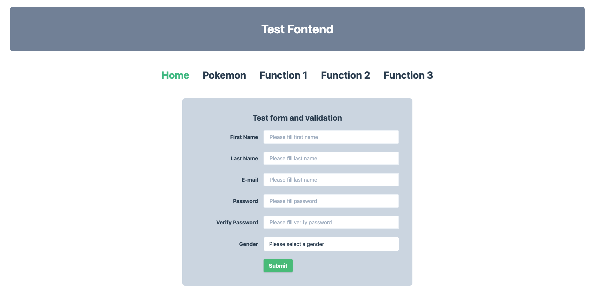
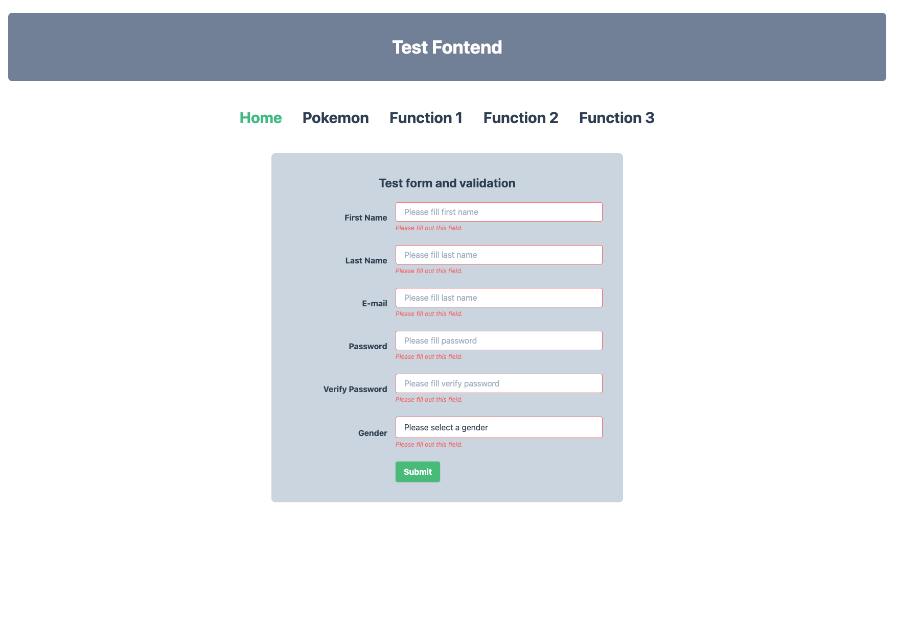
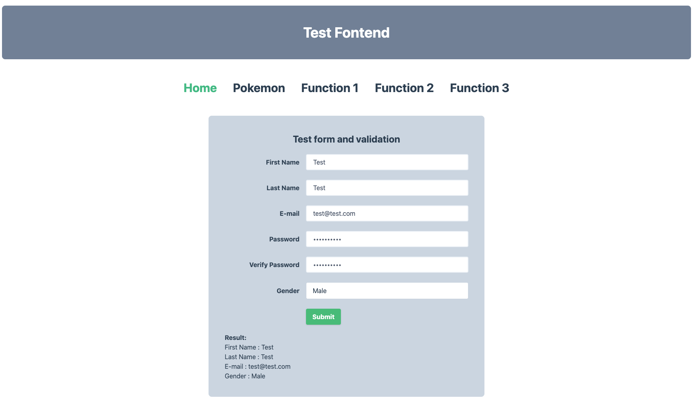
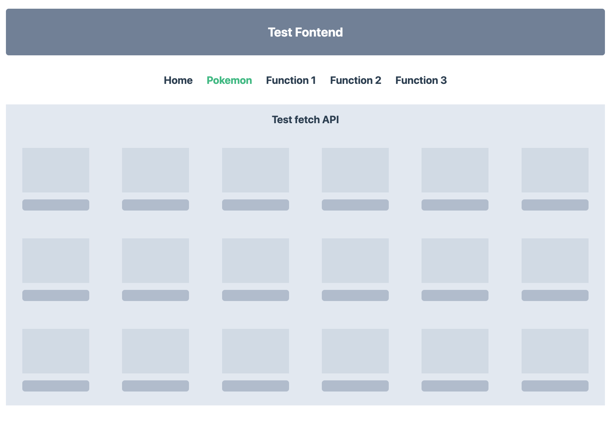
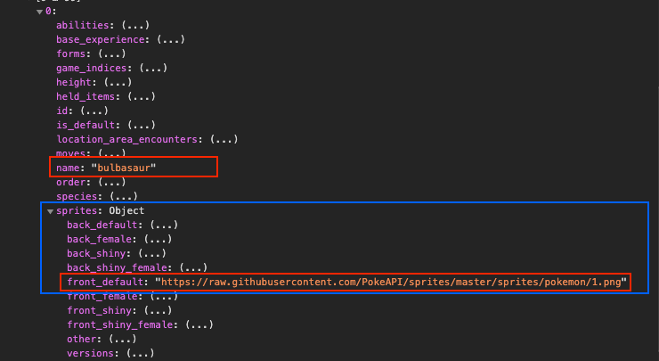
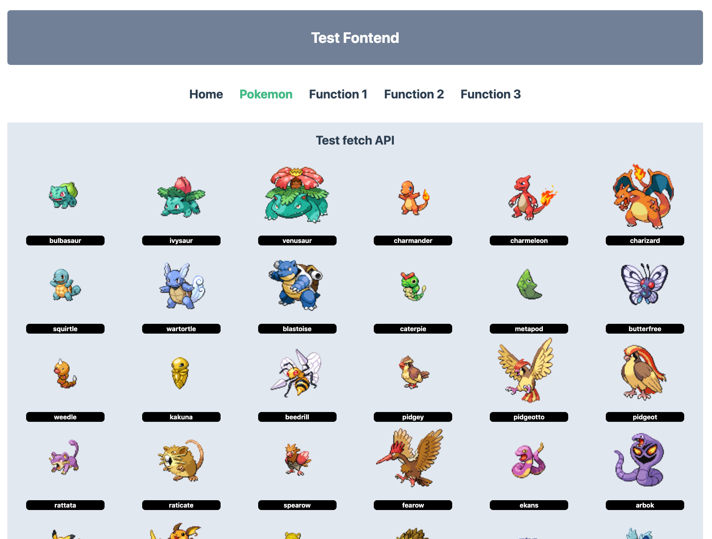

# Test - Frontend Developer

## Requirement

1. สร้าง form และ validate ข้อมูล
2. ดึงข้อมูลจาก pokemon's api และแสดงผล
3. แก้ปัญหาเรื่องสินค้าจาก example-data.json
4. แก้ปัญหาเรื่องวันที่และเวลา
5. แก้ปัญหาเรื่องการตรวจสอบข้อมูลใน array
6. สร้าง route หรือ path สำหรับแสดงผล ข้อที่ 1-5
   Solve problems use JavaScript functions

## Route to display result

    |-- Test form and validation
    |-- Fetch Pokemon's API
    |-- Function 1
    |-- Function 2
    |-- Function 3

## 1. Test form and validation

- ### สร้าง form สำหรับกรอกข้อมูล ดังตัวอย่าง
  
- ### validate inputs ข้อมูลแต่ละชนิดให้ถูกต้อง หากไม่ถูกต้องให้แจ้งเตือน
  
- ### เมื่อ validate form ผ่านให้แสดงผลลัพท์ดังตัวอย่างด้านล่าง
  

## 2. Test fetch Pokemon's api

- ### สร้าง placeholder หรือ skeleton สำหรับการรอ fetch data
  
- ### fetch pokemon's data จาก `https://pokeapi.co/api/v2`
- #### ดึงข้อมูลของ pokemon แต่ละตัวผ่าน api ex. GET-> https://pokeapi.co/api/v2/pokemon/1
- #### ดึงข้อมูลของ pokemon id ที่ 1-104 แล้วนำมาแสดงในหน้ารวม
  
- #### ให้แสดง ชื่อ,รูป ของ pokemon เท่านั้น และแสดง แถวละ 6 ตัว ดังตัวอย่าง
  

### 3. Test Function 1

#### \*ใช้ข้อมูลจาก json ที่แนบไว้กับ github -> exam-data.json

หา product หลัก ที่มี is_editable_price = false หลังจากนั้นให้รวมน้ำหนักสินค้าย่อยทั้งหมด ตอบเอาเฉพาะชื่อ และน่ำหนักรวม เช่น
`[{ name: ‘Wow product’, totalSubProductWeight: 200 }]`
และแสดงผลในหน้า Function 1

### 4. Test Function 2

ให้แปลงรูปแบบวันที่ จาก `2020-08-10T14:54:52+07:00` เป็น format ดังต่อไปนี้

```
10/08/2020 14:54
10 สิงหาคม 2563 // รูปแบบปฏิทินไทย
31 // จำนวนวันในเดือนนี้
3 // ไตรมาตรของเดือนนี้
1597046092 // Unix timestamp
```

แสดงผลลัพท์ให้หน้า Function 2

### 5. Test Function 3

เขียน function ตรวจสอบว่าตัวเลขที่อยู่ใน array ซ้ำกันหรือไม่

```
use case
[] //false
[1] //false
[1,2,3] //false
[1,1] //false
[1,2,1] //false
```

แสดงผลลัพท์ให้หน้า Function 3

## Deployment

- หลังจากืทำการทดสอบเสร็จแล้วให้ commit และ push code ขึ้นไปยัง github ของตนเอง
- ตอบกลับอีเมล์ที่ได้ส่งโจทย์ github link กลับมายังบริษัท
- Deploy application ขึ้นไปยัง Hosting แนะนำผู้ให้ยริการตามด้านล่าง
  - Firebase Hosting
  - Netlify
  - Heroku

## Problem

- หากทีปัญหาหรือข้อสงสงสัยให้ติดต่อกลับโดยด่วน ผ่านทางอีเมล์ หรือ Facebook: Paiduaykanmai Co., Ltd.
